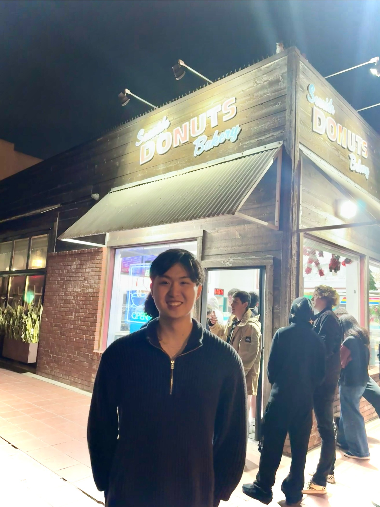

# About Me:


 
 Hello! My name is Harry, and I'm a 3rd-year student at UC San Diego studying **Math, Computer Science, and Cognitive Science**.

 This repository is to introduce myself as a programmer for CSE 110.
 > CSE 110 discusses core software engineering principles, including specification, design, implementation, testing, and process.

P.S. Click [here](#miscellaneous-info) for the miscellaneous info section, where I put my Linkedin and more random trivia about me!

I'm taking this class to learn about software development and deployment, in preparation for my internship this summer at Amazon Web Services on the Foundation Models team. Some core proficiencies I expect to develop from this class are:

1. Version Control: some git commands I want to learn about are:
```
git branch
git merge (generally, resolving merge issues)
git rebase
```
2. System Design - Some key concepts in this field I hope to gain exposure to include
- SLAs
- ACID 
- SOLID software
- OOP
- User Scaling
- Event-Driven Architecture

3. Software Deployment, specifically for Data Science: I think some of the key steps in this process would include
- [x] Model training and validation, which I have experience with
- [ ] Packaging and containerization
- [ ] Integration and API development, modular design
- [ ] Testing and Staging
- [ ] Deployment Monitoring, and Maintenance


## Miscellaneous Info:

- You can connect with me on my [Linkedin](https://www.linkedin.com/in/harry-wang04/)
- I'm a published first author! My [paper](https://ieeexplore.ieee.org/document/10903278/) was on using training a CNN-LSTM model for GPU Temperature forecasting, with a special technique called scheduled sampling.
- Here is a collection of pictures of some food I ate recently! [Food](pictures.md)
- My favorite color is blacl
<!-- 
``` 
Version Control
System Design
Software Deployment, specifically for Data Science   
``` -->